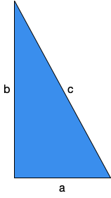

# CPSC 120

## Right Triangle

Let's imagine that you want to make a bunch of raised planter boxes for your family's garden. In order to do that, you need to cut some pieces of lumber to make rectangular boxes.

You only have your hand saw to cut the wood so you prefer to cut the wood along lengths of whole numbers. You'd prefer not to try to figure out how to cut 4.242640687119286 feet or 127.27922061357857 cm of wood.

Most importantly, you've been selected for this task because you know how to use the [Pythagorean theorem](https://en.wikipedia.org/wiki/Pythagorean_theorem) to verify that your planter boxes are square. This means that when you cut and assemble the planter boxes, each corner of the box shall form a 90 degree angle. The idea is if you know the length, width, and the diagonal of the planter box you can adjust the sides until the diagonal is the right length to make perfectly square planter boxes.

The (in)famous formula that you have committed to memory is:


Below is an image of a right (scalene) triangle to help you visualize the different sides. The sides a and b form the 90 degree angle and the side c is what is called the hypotenuse.


Let's write a program that will prompt you to enter three [integer](https://en.wikipedia.org/wiki/Integer) values. (A signed integer in C++ can represent a number as small as -2,147,483,648 and as large as 2,147,483,648.) The first value is the length of the side labeled a, the second value is the length of the side labeled b, and the third value is the length of side c, the hypotenuse.

The challenge is how do you use this program to find the sides of an isosceles right triangle. In other words, can you come up with a right triangle where a is equal to b?

## Requirements

You shall use [cout](https://en.cppreference.com/w/cpp/io/cout) to print messages to the terminal and you shall use [cin](https://en.cppreference.com/w/cpp/io/cin) to read in values from the keyboard.

The program reads in three values from the terminal, stores them in three different variables. Next, the program calculates the sum of the square of a and b,  or . Then the program calculates the square of c, . Finally, the sum of the squares a and b is compared to the square of c to see if the triangle is a right triangle. If , then print out a messaging saying the triangle is a right triangle. Otherwise print out a message that the triangle is not a right triangle. (See example output below.)

(The right way, the easy way, to square a number is to just multiply it with itself. Please don't try to find a more complicated way to do it.)

To compare variables in a C++ program, use the [`if`, `else if` and `else` keywords](https://en.cppreference.com/w/cpp/language/if) and the [comparison operators](https://en.cppreference.com/w/cpp/language/operator_comparison) `==` to determin if the triangle is a right triangle or not.

The starting code defines a series of `TODO` comments which you can use to formulate your plan and develop your program.

Write your program progressively. Compile your program often and check that you're making progress. Make sure your program behaves the way you expect.

The output of your program must match the output given in the section Example Output below.

## Compiling

To compile your program, you use the `clang++` command. If you want to save your program with a unique name you use the `-o` option. (Do not type the `$`, that is the prompt.)
```
$ clang++ -std=c++14 right_triangle -o right_triangle.cc
$ ./right_triangle
```
Warning: do not use `-o` to overwrite your .cc file. For example, `clang++ foo.cc -o foo.cc` will delete your work.

## Don't Forget

Please remember that:
- You need to put a header in every file.
- You need to follow the [Google C++ Style Guide](https://google.github.io/styleguide/cppguide.html).
- Remove the `TODO` comments.

## Testing Your Code

Computers only ever do exactly what they are told, exactly the way they are told it, and never anything else. Testing is an important process to writing a program. You need to test for the program to behave correctly and test that the program behaves incorrectly in a predictable way.

As programmers we have to remember that there are a lot of ways that we can write the wrong program and only one to a few ways to write the correct program. We have to be aware of [cognitive biases](https://en.wikipedia.org/wiki/List_of_cognitive_biases) that we may exercise that lead us to believe we have correctly completed our program. That belief may be incorrect and our software may have errors. [Errors in software](https://www.wired.com/2005/11/historys-worst-software-bugs/) may lead to loss of [life](https://www.nytimes.com/2019/03/14/business/boeing-737-software-update.html), [property](https://en.wikipedia.org/wiki/Mariner_1), [reputation](https://en.wikipedia.org/wiki/Pentium_FDIV_bug), or [all of the above](https://en.wikipedia.org/wiki/2009%E2%80%9311_Toyota_vehicle_recalls).

### Test strategy

Start simple, and work your way up. Good tests are specific, cover a broad range of fundamentally different possibilities, can identify issues quickly, easily, and directly, without need for much set up, and can almost be diagnosed by inspection if the code fails to execute the test correctly.

## Example Output

Please ensure your program's output is identical to the example below.
```
$ clang++ -std=c++14 right_triangle.cc -o right_triangle
$ ./right_triangle 
What's the length of the first side? 3
What's the length of the second side? 4
What's the length of the diagonal or hypotenuse? 5

A triangle with sides of length 3 and 4 with a hypotenuse of length 5 is a right triangle!
$ ./right_triangle 
What's the length of the first side? 2
What's the length of the second side? 2
What's the length of the diagonal or hypotenuse? 4

A triangle with sides of length 2 and 2 with a hypotenuse of length 4 is not a right triangle.
```

